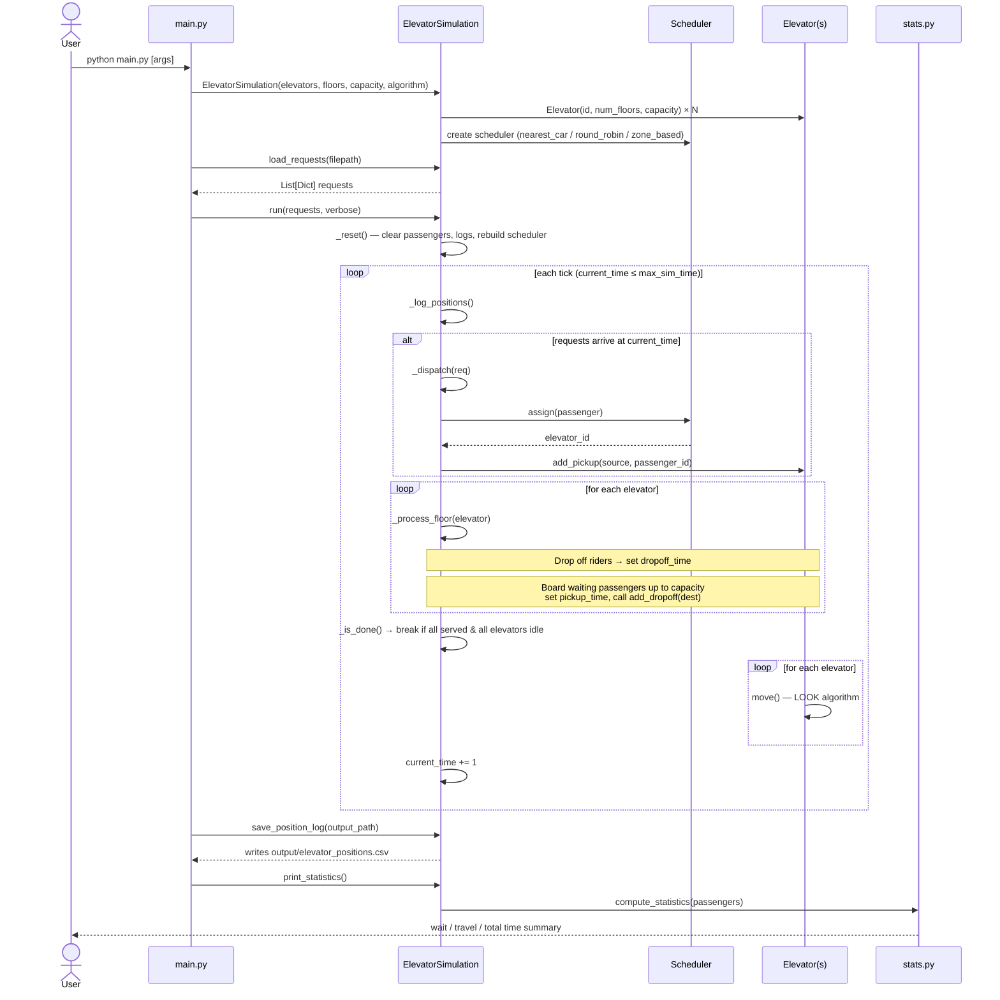
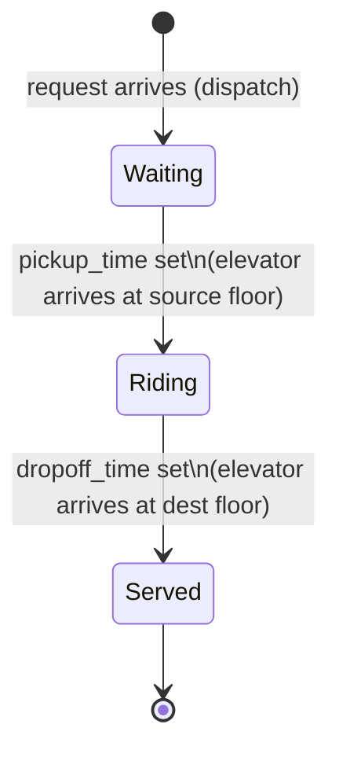
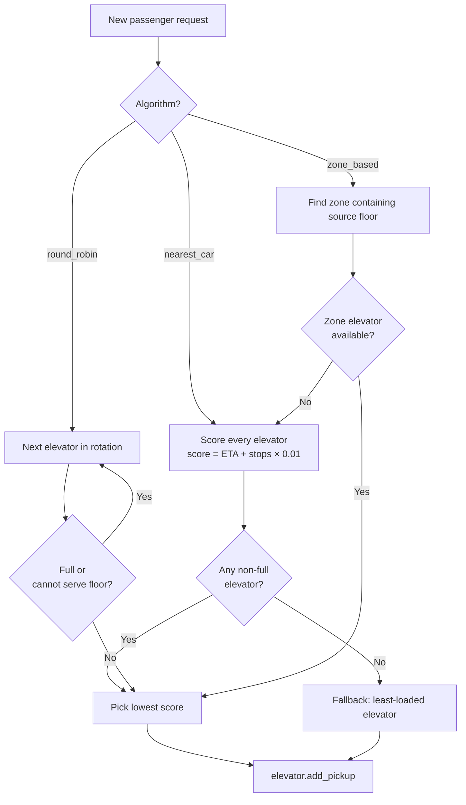

# Elevator Simulation — Diagrams

The diagrams below show the full execution flow from CLI invocation through to statistics output.

## Sequence Diagram

## Passenger State Machine

## Scheduler Decision Flow

