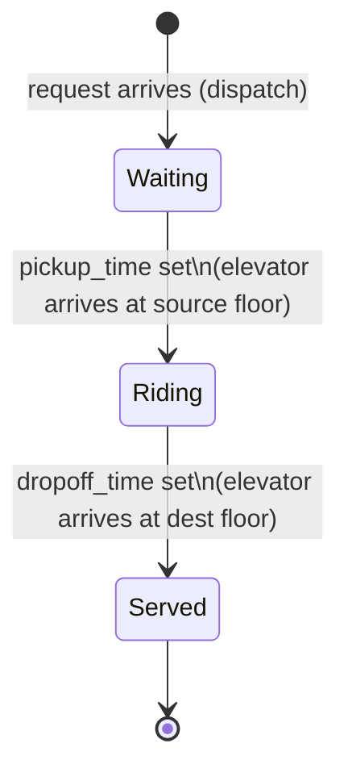
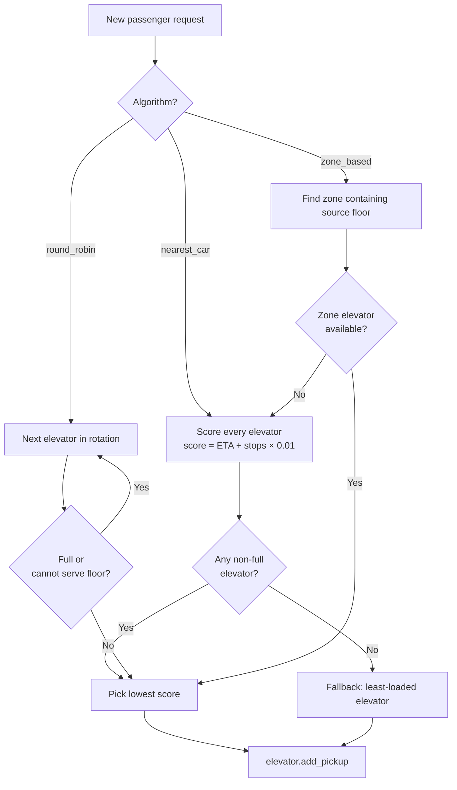

# Elevator Simulation — Sequence Diagram

The diagram below shows the full execution flow from CLI invocation through to statistics output.

```mermaid
sequenceDiagram
    actor User
    participant Main as main.py
    participant Sim as ElevatorSimulation
    participant Sched as Scheduler
    participant Elev as Elevator
    participant Pax as Passenger

    User->>Main: python main.py [--flags]
    Main->>Main: parse CLI arguments

    Main->>Sim: __init__(num_elevators, num_floors, capacity, algorithm)
    Sim->>Sim: validate inputs (raises ValueError if invalid)
    Sim->>Elev: create N Elevator objects (start at floor 1)
    Sim->>Sched: create Scheduler (NearestCar / RoundRobin / ZoneBased)

    Main->>Sim: load_requests(filepath)
    Sim->>Sim: validate CSV columns (raises ValueError if missing)
    Sim->>Sim: parse rows → list of {time, id, source, dest}
    Sim-->>Main: requests[]

    Main->>Sim: run(requests)
    Sim->>Sim: group requests by arrival time
    Sim->>Sim: compute max_sim_time = ⌈passengers/capacity⌉ × floors × 2

    loop Each tick T (until done or max_sim_time)

        Sim->>Sim: _log_positions() → append to position_log

        opt Requests arriving at tick T
            Sim->>Pax: Passenger(id, request_time, source, dest)
            Note over Pax: state = waiting

            alt source == dest (same floor)
                Sim->>Pax: pickup_time = dropoff_time = T
                Note over Pax: state = served instantly
            else normal request
                Sim->>Sched: assign(passenger)
                Sched->>Elev: estimate_pickup_time(source) for each elevator
                Sched-->>Sim: elevator_id (lowest score wins)
                Sim->>Elev: add_pickup(source, passenger_id)
                Note over Elev: only pickup stop registered at dispatch
            end
        end

        loop Each Elevator
            Sim->>Elev: _process_floor(elevator)

            opt elevator is at a stop floor
                Note over Elev,Pax: DROP OFF first (frees capacity)
                Elev->>Pax: dropoff_time = T
                Note over Pax: state = served

                Note over Elev,Pax: PICK UP next (FIFO, up to capacity)
                Elev->>Pax: pickup_time = T
                Note over Pax: state = riding
                Sim->>Elev: add_dropoff(dest, passenger_id)
                Note over Elev: dropoff stop registered NOW (not at dispatch)
            end
        end

        Sim->>Sim: _is_done?
        Note over Sim: all passengers served AND all elevators idle?

        alt All done
            Sim-->>Main: exit loop
        else Not done
            loop Each Elevator
                Sim->>Elev: move()
                Elev->>Elev: update_direction() via LOOK algorithm
                Note over Elev: UP → next stop above; reverse if none<br/>DOWN → next stop below; reverse if none<br/>IDLE → nearest stop at a different floor
                Elev->>Elev: current_floor ± 1
            end
            Sim->>Sim: current_time += 1
        end

    end

    opt Unserved passengers remain
        Sim->>User: warnings.warn("N unserved passengers: [...]")
    end

    Main->>Sim: print_statistics()
    Sim->>Sim: compute_statistics(passengers)
    Sim-->>User: print wait / travel / total time summary

    Main->>Sim: save_position_log(output_path)
    Sim-->>User: write output/elevator_positions.csv
```

## Passenger State Machine



## Scheduler Decision Flow


