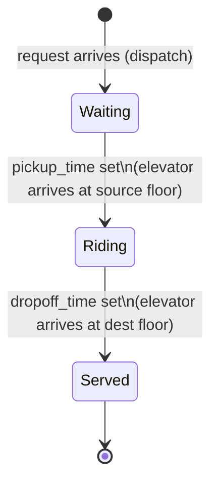
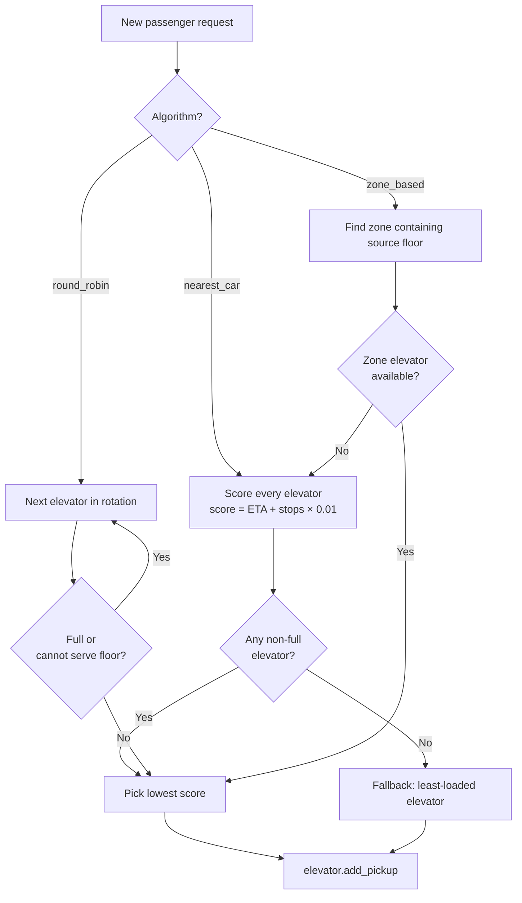

# Elevator Simulation —  Diagram

The diagram below shows the full execution flow from CLI invocation through to statistics output.

## Passenger State Machine

```mermaid
stateDiagram-v2
    [*] --> Waiting : request arrives (dispatch)
    Waiting --> Riding : pickup_time set\n(elevator arrives at source floor)
    Riding --> Served : dropoff_time set\n(elevator arrives at dest floor)
    Served --> [*]
```

## Scheduler Decision Flow

```mermaid
flowchart TD
    A[New passenger request] --> B{Algorithm?}

    B -->|nearest_car| C[Score every elevator\nscore = ETA + stops × 0.01]
    C --> D{Any non-full\nelevator?}
    D -->|Yes| E[Pick lowest score]
    D -->|No| F[Fallback: least-loaded elevator]

    B -->|round_robin| G[Next elevator in rotation]
    G --> H{Full or\ncannot serve floor?}
    H -->|Yes| G
    H -->|No| E

    B -->|zone_based| I[Find zone containing source floor]
    I --> J{Zone elevator\navailable?}
    J -->|Yes| E
    J -->|No| C

    E --> K[elevator.add_pickup]
    F --> K
```
